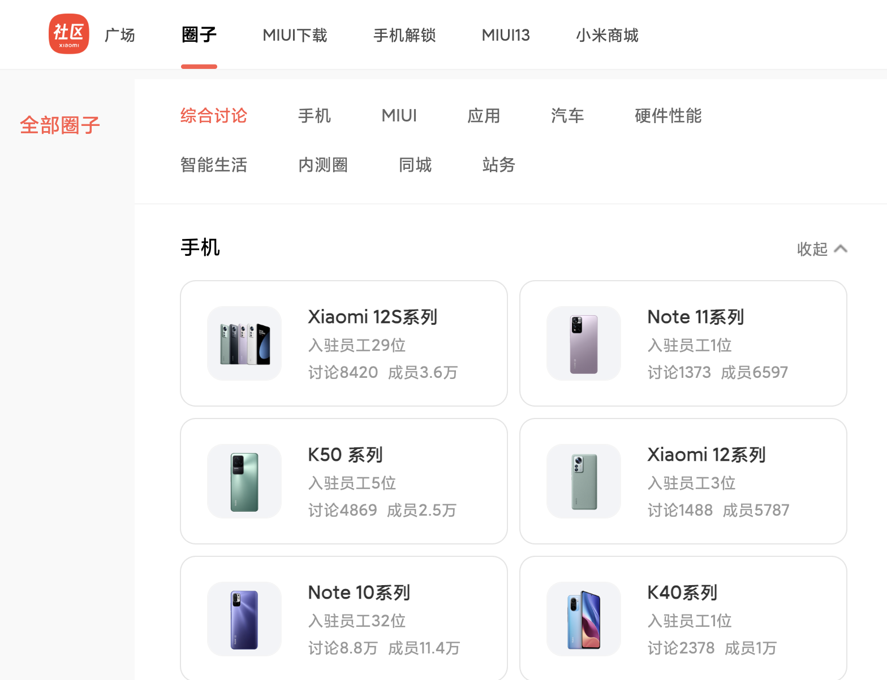

# 哪台小米/红米手机买来刷机合适呢？

> Which Mi Phone should buy for flashing?

出于各种原因，我们可能会选择购买一台小米/红米手机，并考虑“刷了它”，比如：

- 需要刷机进行自动化测试
- 想要抢先体验新的 Android 版本，或者原生系统的新功能
- 想要深度定制、优化、美化系统，换个三方发行版、或者装多个系统
- 想要安装更规矩或者更小尺寸的安卓应用软件
- 或者想要安装海外版游戏
- 手机系统莫名其妙出问题了，需要刷机修复
- 或者，单纯喜欢玩

同样因为各种原因，“Mi-Phone” 的刷机门槛越来越高，比如：

- 可能需要等待 168 小时（7天）或者更久
- 需要绑定个人账号和设备
- 需要有靠谱的“ROM”资源

而“ROM靠谱与否”，除了官方运营策略之外，客观上很大的因素也取决于用户数量、开发者数量，它们决定了资料、资源的多寡。作为普通用户，我们解决不了官方运营提出的规则，但是可以在入坑前**了解哪些手机更为热门，潜在的资源数量更多，刷机门槛相对更低一些**。

对于刷机用户而言，热门指标其实只需要看：

- 有多少官方员工愿意加入社区进行讨论或者贡献功能
- 哪些机型的社区用户数量比较多，引起官方的重视可能性比较高
- 哪些机型的实际讨论、关注度更高

基于此，我整理了来自官方中文论坛首页（[https://www.xiaomi.cn/board](https://www.xiaomi.cn/board)）上公开展示的数据，做了一个简单的排行榜，供“喜欢折腾的你”快速选择合适的手机：

## 比较值得购入用于刷机的设备

> **Xiaomi 10/10Pro**：有193位社区认证的小米员工入驻论坛，专区用户86.3万，话题讨论共计55.2万
> **Xiaomi 10至尊纪念版**：有103位社区认证的小米员工入驻论坛，专区用户36.2万，话题讨论共计21.7万

官方社区中不论是员工人数、用户人数、话题讨论数量都非常多的板块，资源丰富。

> **Redmi K30/Pro**：有62位社区认证的小米员工入驻论坛，专区用户66万，话题讨论共计35万
> **Redmi K40/Pro**：有69位社区认证的小米员工入驻论坛，专区用户35.8万，话题讨论共计38.7万
> **Redmi K50/Pro**：有50位社区认证的小米员工入驻论坛，专区用户13万，话题讨论共计7.6万

相比 Mi10 数据稍低的板块，不论国内、海外用户、ROM 资料都比较多的机型。

> **Note 9系列**：有15位社区认证的小米员工入驻论坛，专区用户36.4万，话题讨论共计13.9万
> **Xiaomi 9**：有19位社区认证的小米员工入驻论坛，专区用户29.4万，话题讨论共计14.6万
> **Xiaomi 8系列**：有10位社区认证的小米员工入驻论坛，专区用户42.4万，话题讨论共计13.7万

相比 K 系列数据更低一些的板块，二手市场购入一台低成本设备，然后用来刷机也未尝不可。

> **Xiaomi 11**：有85位社区认证的小米员工入驻论坛，专区用户28.6万，话题讨论共计39.4万
> **Xiaomi 11 Ultra**：有120位社区认证的小米员工入驻论坛，专区用户18.6万，话题讨论共计19.7万

虽然用户没有上面的版块多，但是有比较多的小米社区认证的员工/开发者。

## 我个人测试过的小米设备

- Redmi 11T PRO（等待解锁后尝试刷机）
- Redmi K30 PRO （MIUI 12.5，后降级 MIUI 11）[刷机记录](https://soulteary.com/2021/10/22/mi-k30-pro-flashing-miui-125-overseas-version.html)
- Redmi K20 PRO （Android 10）[刷机记录](https://soulteary.com/2019/09/08/xiaomi-k20pro-experience-android-10.html)
- Xiaomi MAX2 （Android 8.1）
- Xiaomi MAX （Android 7.0）
- Xiaomi 5 PLUS
- Xiaomi 3

--------------------

## 官方公开数据（2022.09）

### 小米社区认证员工加入最多的社区

- 1 **Xiaomi 10/10Pro**：有193位社区认证的小米员工入驻论坛，专区用户86.3万，话题讨论共计55.2万
- 2 **Xiaomi 12**：有130位社区认证的小米员工入驻论坛，专区用户16.9万，话题讨论共计3.8万
- 3 **Xiaomi 11 Ultra**：有120位社区认证的小米员工入驻论坛，专区用户18.6万，话题讨论共计19.7万
- 4 **Xiaomi 12 Pro**：有117位社区认证的小米员工入驻论坛，专区用户16.5万，话题讨论共计5万
- 5 **Xiaomi 10至尊纪念版**：有103位社区认证的小米员工入驻论坛，专区用户36.2万，话题讨论共计21.7万
- 6 **Xiaomi MIX 4**：有89位社区认证的小米员工入驻论坛，专区用户10.2万，话题讨论共计6.9万
- 7 **Xiaomi 11**：有85位社区认证的小米员工入驻论坛，专区用户28.6万，话题讨论共计39.4万
- 8 **Redmi K40/Pro**：有69位社区认证的小米员工入驻论坛，专区用户35.8万，话题讨论共计38.7万
- 9 **Redmi K30/Pro**：有62位社区认证的小米员工入驻论坛，专区用户66万，话题讨论共计35万
- 10 **Redmi K50/Pro**：有50位社区认证的小米员工入驻论坛，专区用户13万，话题讨论共计7.6万
- 11 **Xiaomi 11 Pro**：有47位社区认证的小米员工入驻论坛，专区用户13.3万，话题讨论共计14.5万
- 12 **Xiaomi Civi**：有38位社区认证的小米员工入驻论坛，专区用户4.8万，话题讨论共计10000条
- 13 **K30至尊纪念版**：有36位社区认证的小米员工入驻论坛，专区用户45.9万，话题讨论共计33.3万
- 14 **Note 10系列**：有32位社区认证的小米员工入驻论坛，专区用户11.4万，话题讨论共计8.8万
- 15 **Redmi Note 11/Pro**：有31位社区认证的小米员工入驻论坛，专区用户7万，话题讨论共计2.6万
- 16 **Xiaomi 12S系列**：有29位社区认证的小米员工入驻论坛，专区用户3.6万，话题讨论共计8420条
- 17 **Xiaomi 11青春版**：有29位社区认证的小米员工入驻论坛，专区用户2.6万，话题讨论共计1.5万
- 18 **MIX Fold**：有24位社区认证的小米员工入驻论坛，专区用户1.6万，话题讨论共计1.3万
- 19 **Xiaomi 12X**：有23位社区认证的小米员工入驻论坛，专区用户2.9万，话题讨论共计1.4万
- 20 **Xiaomi 12S Ultra**：有20位社区认证的小米员工入驻论坛，专区用户3.3万，话题讨论共计1.8万
- 21 **Xiaomi 9**：有19位社区认证的小米员工入驻论坛，专区用户29.4万，话题讨论共计14.6万
- 22 **Redmi K50电竞版**：有18位社区认证的小米员工入驻论坛，专区用户3.2万，话题讨论共计1.2万
- 23 **K20系列**：有17位社区认证的小米员工入驻论坛，专区用户36.3万，话题讨论共计18.2万
- 24 **Note 9系列**：有15位社区认证的小米员工入驻论坛，专区用户36.4万，话题讨论共计13.9万
- 25 **Xiaomi 10S**：有15位社区认证的小米员工入驻论坛，专区用户15.1万，话题讨论共计19.5万
- 26 **K30S至尊纪念版**：有14位社区认证的小米员工入驻论坛，专区用户10.7万，话题讨论共计11.6万
- 27 **Xiaomi10青春版**：有14位社区认证的小米员工入驻论坛，专区用户13.3万，话题讨论共计4万
- 28 **MIX FOLD 2**：有13位社区认证的小米员工入驻论坛，专区用户8179位，话题讨论共计3576条
- 29 **Redmi K40游戏增强版**：有11位社区认证的小米员工入驻论坛，专区用户8.2万，话题讨论共计11.4万
- 30 **Xiaomi CC9 Pro**：有11位社区认证的小米员工入驻论坛，专区用户5.6万，话题讨论共计2.8万
- 31 **Xiaomi 8系列**：有10位社区认证的小米员工入驻论坛，专区用户42.4万，话题讨论共计13.7万
- 32 **Xiaomi Civi 1S**：有10位社区认证的小米员工入驻论坛，专区用户4432位，话题讨论共计690条
- 33 **Redmi Note 11T Pro/Pro +**：有9位社区认证的小米员工入驻论坛，专区用户3.9万，话题讨论共计1.7万
- 34 **Redmi K40S**：有9位社区认证的小米员工入驻论坛，专区用户2.2万，话题讨论共计9443条
- 35 **Note 8系列**：有8位社区认证的小米员工入驻论坛，专区用户27.3万，话题讨论共计10.8万
- 36 **Redmi 10X**：有8位社区认证的小米员工入驻论坛，专区用户9.2万，话题讨论共计7.5万
- 37 **K50 至尊版**：有7位社区认证的小米员工入驻论坛，专区用户2万，话题讨论共计8761条
- 38 **Xiaomi 9Pro 5G**：有7位社区认证的小米员工入驻论坛，专区用户12万，话题讨论共计4.3万
- 39 **Xiaomi MIX2S**：有7位社区认证的小米员工入驻论坛，专区用户13万，话题讨论共计3.9万
- 40 **Xiaomi 6系列**：有6位社区认证的小米员工入驻论坛，专区用户25.3万，话题讨论共计5.6万
- 41 **Xiaomi CC9**：有6位社区认证的小米员工入驻论坛，专区用户5.7万，话题讨论共计2.4万
- 42 **K50 系列**：有5位社区认证的小米员工入驻论坛，专区用户2.5万，话题讨论共计4869条
- 43 **Redmi 9系列**：有5位社区认证的小米员工入驻论坛，专区用户2.9万，话题讨论共计1.3万
- 44 **Xiaomi 12S Pro**：有5位社区认证的小米员工入驻论坛，专区用户1.4万，话题讨论共计5584条
- 45 **Xiaomi 9SE**：有5位社区认证的小米员工入驻论坛，专区用户5.9万，话题讨论共计2.1万
- 46 **Xiaomi 11系列**：有4位社区认证的小米员工入驻论坛，专区用户9991位，话题讨论共计3440条
- 47 **Mix系列**：有4位社区认证的小米员工入驻论坛，专区用户1859位，话题讨论共计394条
- 48 **Xiaomi 12 Pro 天玑版**：有4位社区认证的小米员工入驻论坛，专区用户1243位，话题讨论共计521条
- 49 **Xiaomi MIX2**：有4位社区认证的小米员工入驻论坛，专区用户8万，话题讨论共计1.5万
- 50 **Xiaomi 12系列**：有3位社区认证的小米员工入驻论坛，专区用户5787位，话题讨论共计1488条
- 51 **Xiaomi 12S**：有3位社区认证的小米员工入驻论坛，专区用户8653位，话题讨论共计3317条
- 52 **Civi系列**：有2位社区认证的小米员工入驻论坛，专区用户1013位，话题讨论共计126条
- 53 **Xiaomi MIX3**：有2位社区认证的小米员工入驻论坛，专区用户3.6万，话题讨论共计2万
- 54 **Note 11系列**：有1位社区认证的小米员工入驻论坛，专区用户6597位，话题讨论共计1373条
- 55 **K40系列**：有1位社区认证的小米员工入驻论坛，专区用户10000位，话题讨论共计2378条
- 56 **Redmi 8系列**：有1位社区认证的小米员工入驻论坛，专区用户4.2万，话题讨论共计7420条
- 57 **Xiaomi 10系列**：没有社区认证的小米员工入驻论坛，专区用户6380位，话题讨论共计1323条
- 58 **K30系列**：没有社区认证的小米员工入驻论坛，专区用户3493位，话题讨论共计725条
- 59 **Xiaomi 9系列**：没有社区认证的小米员工入驻论坛，专区用户1375位，话题讨论共计130条
- 60 **Redmi 10 系列**：没有社区认证的小米员工入驻论坛，专区用户620位，话题讨论共计139条
- 61 **Redmi Note 11 SE**：没有社区认证的小米员工入驻论坛，专区用户409位，话题讨论共计62条
- 62 **Redmi 10A**：没有社区认证的小米员工入驻论坛，专区用户1175位，话题讨论共计175条

### 小米社区用户数量最多的社区

- 1 **Xiaomi 10/10Pro**：有193位社区认证的小米员工入驻论坛，专区用户86.3万，话题讨论共计55.2万
- 2 **Redmi K30/Pro**：有62位社区认证的小米员工入驻论坛，专区用户66万，话题讨论共计35万
- 3 **K30至尊纪念版**：有36位社区认证的小米员工入驻论坛，专区用户45.9万，话题讨论共计33.3万
- 4 **Xiaomi 8系列**：有10位社区认证的小米员工入驻论坛，专区用户42.4万，话题讨论共计13.7万
- 5 **Note 9系列**：有15位社区认证的小米员工入驻论坛，专区用户36.4万，话题讨论共计13.9万
- 6 **K20系列**：有17位社区认证的小米员工入驻论坛，专区用户36.3万，话题讨论共计18.2万
- 7 **Xiaomi 10至尊纪念版**：有103位社区认证的小米员工入驻论坛，专区用户36.2万，话题讨论共计21.7万
- 8 **Redmi K40/Pro**：有69位社区认证的小米员工入驻论坛，专区用户35.8万，话题讨论共计38.7万
- 9 **Xiaomi 9**：有19位社区认证的小米员工入驻论坛，专区用户29.4万，话题讨论共计14.6万
- 10 **Xiaomi 11**：有85位社区认证的小米员工入驻论坛，专区用户28.6万，话题讨论共计39.4万
- 11 **Note 8系列**：有8位社区认证的小米员工入驻论坛，专区用户27.3万，话题讨论共计10.8万
- 12 **Xiaomi 6系列**：有6位社区认证的小米员工入驻论坛，专区用户25.3万，话题讨论共计5.6万
- 13 **Xiaomi 11 Ultra**：有120位社区认证的小米员工入驻论坛，专区用户18.6万，话题讨论共计19.7万
- 14 **Xiaomi 12**：有130位社区认证的小米员工入驻论坛，专区用户16.9万，话题讨论共计3.8万
- 15 **Xiaomi 12 Pro**：有117位社区认证的小米员工入驻论坛，专区用户16.5万，话题讨论共计5万
- 16 **Xiaomi 10S**：有15位社区认证的小米员工入驻论坛，专区用户15.1万，话题讨论共计19.5万
- 17 **Xiaomi 11 Pro**：有47位社区认证的小米员工入驻论坛，专区用户13.3万，话题讨论共计14.5万
- 18 **Xiaomi10青春版**：有14位社区认证的小米员工入驻论坛，专区用户13.3万，话题讨论共计4万
- 19 **Redmi K50/Pro**：有50位社区认证的小米员工入驻论坛，专区用户13万，话题讨论共计7.6万
- 20 **Xiaomi MIX2S**：有7位社区认证的小米员工入驻论坛，专区用户13万，话题讨论共计3.9万
- 21 **Xiaomi 9Pro 5G**：有7位社区认证的小米员工入驻论坛，专区用户12万，话题讨论共计4.3万
- 22 **Note 10系列**：有32位社区认证的小米员工入驻论坛，专区用户11.4万，话题讨论共计8.8万
- 23 **K30S至尊纪念版**：有14位社区认证的小米员工入驻论坛，专区用户10.7万，话题讨论共计11.6万
- 24 **Xiaomi MIX 4**：有89位社区认证的小米员工入驻论坛，专区用户10.2万，话题讨论共计6.9万
- 25 **Redmi 10X**：有8位社区认证的小米员工入驻论坛，专区用户9.2万，话题讨论共计7.5万
- 26 **Redmi K40游戏增强版**：有11位社区认证的小米员工入驻论坛，专区用户8.2万，话题讨论共计11.4万
- 27 **Xiaomi MIX2**：有4位社区认证的小米员工入驻论坛，专区用户8万，话题讨论共计1.5万
- 28 **Redmi Note 11/Pro**：有31位社区认证的小米员工入驻论坛，专区用户7万，话题讨论共计2.6万
- 29 **Xiaomi 9SE**：有5位社区认证的小米员工入驻论坛，专区用户5.9万，话题讨论共计2.1万
- 30 **Xiaomi CC9**：有6位社区认证的小米员工入驻论坛，专区用户5.7万，话题讨论共计2.4万
- 31 **Xiaomi CC9 Pro**：有11位社区认证的小米员工入驻论坛，专区用户5.6万，话题讨论共计2.8万
- 32 **Xiaomi Civi**：有38位社区认证的小米员工入驻论坛，专区用户4.8万，话题讨论共计10000条
- 33 **Redmi 8系列**：有1位社区认证的小米员工入驻论坛，专区用户4.2万，话题讨论共计7420条
- 34 **Redmi Note 11T Pro/Pro +**：有9位社区认证的小米员工入驻论坛，专区用户3.9万，话题讨论共计1.7万
- 35 **Xiaomi 12S系列**：有29位社区认证的小米员工入驻论坛，专区用户3.6万，话题讨论共计8420条
- 36 **Xiaomi MIX3**：有2位社区认证的小米员工入驻论坛，专区用户3.6万，话题讨论共计2万
- 37 **Xiaomi 12S Ultra**：有20位社区认证的小米员工入驻论坛，专区用户3.3万，话题讨论共计1.8万
- 38 **Redmi K50电竞版**：有18位社区认证的小米员工入驻论坛，专区用户3.2万，话题讨论共计1.2万
- 39 **Xiaomi 12X**：有23位社区认证的小米员工入驻论坛，专区用户2.9万，话题讨论共计1.4万
- 40 **Redmi 9系列**：有5位社区认证的小米员工入驻论坛，专区用户2.9万，话题讨论共计1.3万
- 41 **Xiaomi 11青春版**：有29位社区认证的小米员工入驻论坛，专区用户2.6万，话题讨论共计1.5万
- 42 **K50 系列**：有5位社区认证的小米员工入驻论坛，专区用户2.5万，话题讨论共计4869条
- 43 **Redmi K40S**：有9位社区认证的小米员工入驻论坛，专区用户2.2万，话题讨论共计9443条
- 44 **K50 至尊版**：有7位社区认证的小米员工入驻论坛，专区用户2万，话题讨论共计8761条
- 45 **MIX Fold**：有24位社区认证的小米员工入驻论坛，专区用户1.6万，话题讨论共计1.3万
- 46 **Xiaomi 12S Pro**：有5位社区认证的小米员工入驻论坛，专区用户1.4万，话题讨论共计5584条
- 47 **K40系列**：有1位社区认证的小米员工入驻论坛，专区用户10000位，话题讨论共计2378条
- 48 **Xiaomi 11系列**：有4位社区认证的小米员工入驻论坛，专区用户9991位，话题讨论共计3440条
- 49 **Xiaomi 12S**：有3位社区认证的小米员工入驻论坛，专区用户8653位，话题讨论共计3317条
- 50 **MIX FOLD 2**：有13位社区认证的小米员工入驻论坛，专区用户8179位，话题讨论共计3576条
- 51 **Note 11系列**：有1位社区认证的小米员工入驻论坛，专区用户6597位，话题讨论共计1373条
- 52 **Xiaomi 10系列**：没有社区认证的小米员工入驻论坛，专区用户6380位，话题讨论共计1323条
- 53 **Xiaomi 12系列**：有3位社区认证的小米员工入驻论坛，专区用户5787位，话题讨论共计1488条
- 54 **Xiaomi Civi 1S**：有10位社区认证的小米员工入驻论坛，专区用户4432位，话题讨论共计690条
- 55 **K30系列**：没有社区认证的小米员工入驻论坛，专区用户3493位，话题讨论共计725条
- 56 **Mix系列**：有4位社区认证的小米员工入驻论坛，专区用户1859位，话题讨论共计394条
- 57 **Xiaomi 9系列**：没有社区认证的小米员工入驻论坛，专区用户1375位，话题讨论共计130条
- 58 **Xiaomi 12 Pro 天玑版**：有4位社区认证的小米员工入驻论坛，专区用户1243位，话题讨论共计521条
- 59 **Redmi 10A**：没有社区认证的小米员工入驻论坛，专区用户1175位，话题讨论共计175条
- 60 **Civi系列**：有2位社区认证的小米员工入驻论坛，专区用户1013位，话题讨论共计126条
- 61 **Redmi 10 系列**：没有社区认证的小米员工入驻论坛，专区用户620位，话题讨论共计139条
- 62 **Redmi Note 11 SE**：没有社区认证的小米员工入驻论坛，专区用户409位，话题讨论共计62条

### 小米社区活跃度最高的社区

- 1 **Xiaomi 10/10Pro**：有193位社区认证的小米员工入驻论坛，专区用户86.3万，话题讨论共计55.2万
- 2 **Xiaomi 11**：有85位社区认证的小米员工入驻论坛，专区用户28.6万，话题讨论共计39.4万
- 3 **Redmi K40/Pro**：有69位社区认证的小米员工入驻论坛，专区用户35.8万，话题讨论共计38.7万
- 4 **Redmi K30/Pro**：有62位社区认证的小米员工入驻论坛，专区用户66万，话题讨论共计35万
- 5 **K30至尊纪念版**：有36位社区认证的小米员工入驻论坛，专区用户45.9万，话题讨论共计33.3万
- 6 **Xiaomi 10至尊纪念版**：有103位社区认证的小米员工入驻论坛，专区用户36.2万，话题讨论共计21.7万
- 7 **Xiaomi 11 Ultra**：有120位社区认证的小米员工入驻论坛，专区用户18.6万，话题讨论共计19.7万
- 8 **Xiaomi 10S**：有15位社区认证的小米员工入驻论坛，专区用户15.1万，话题讨论共计19.5万
- 9 **K20系列**：有17位社区认证的小米员工入驻论坛，专区用户36.3万，话题讨论共计18.2万
- 10 **Xiaomi 9**：有19位社区认证的小米员工入驻论坛，专区用户29.4万，话题讨论共计14.6万
- 11 **Xiaomi 11 Pro**：有47位社区认证的小米员工入驻论坛，专区用户13.3万，话题讨论共计14.5万
- 12 **Note 9系列**：有15位社区认证的小米员工入驻论坛，专区用户36.4万，话题讨论共计13.9万
- 13 **Xiaomi 8系列**：有10位社区认证的小米员工入驻论坛，专区用户42.4万，话题讨论共计13.7万
- 14 **K30S至尊纪念版**：有14位社区认证的小米员工入驻论坛，专区用户10.7万，话题讨论共计11.6万
- 15 **Redmi K40游戏增强版**：有11位社区认证的小米员工入驻论坛，专区用户8.2万，话题讨论共计11.4万
- 16 **Note 8系列**：有8位社区认证的小米员工入驻论坛，专区用户27.3万，话题讨论共计10.8万
- 17 **Note 10系列**：有32位社区认证的小米员工入驻论坛，专区用户11.4万，话题讨论共计8.8万
- 18 **Redmi K50/Pro**：有50位社区认证的小米员工入驻论坛，专区用户13万，话题讨论共计7.6万
- 19 **Redmi 10X**：有8位社区认证的小米员工入驻论坛，专区用户9.2万，话题讨论共计7.5万
- 20 **Xiaomi MIX 4**：有89位社区认证的小米员工入驻论坛，专区用户10.2万，话题讨论共计6.9万
- 21 **Xiaomi 6系列**：有6位社区认证的小米员工入驻论坛，专区用户25.3万，话题讨论共计5.6万
- 22 **Xiaomi 12 Pro**：有117位社区认证的小米员工入驻论坛，专区用户16.5万，话题讨论共计5万
- 23 **Xiaomi 9Pro 5G**：有7位社区认证的小米员工入驻论坛，专区用户12万，话题讨论共计4.3万
- 24 **Xiaomi10青春版**：有14位社区认证的小米员工入驻论坛，专区用户13.3万，话题讨论共计4万
- 25 **Xiaomi MIX2S**：有7位社区认证的小米员工入驻论坛，专区用户13万，话题讨论共计3.9万
- 26 **Xiaomi 12**：有130位社区认证的小米员工入驻论坛，专区用户16.9万，话题讨论共计3.8万
- 27 **Xiaomi CC9 Pro**：有11位社区认证的小米员工入驻论坛，专区用户5.6万，话题讨论共计2.8万
- 28 **Redmi Note 11/Pro**：有31位社区认证的小米员工入驻论坛，专区用户7万，话题讨论共计2.6万
- 29 **Xiaomi CC9**：有6位社区认证的小米员工入驻论坛，专区用户5.7万，话题讨论共计2.4万
- 30 **Xiaomi 9SE**：有5位社区认证的小米员工入驻论坛，专区用户5.9万，话题讨论共计2.1万
- 31 **Xiaomi MIX3**：有2位社区认证的小米员工入驻论坛，专区用户3.6万，话题讨论共计2万
- 32 **Xiaomi 12S Ultra**：有20位社区认证的小米员工入驻论坛，专区用户3.3万，话题讨论共计1.8万
- 33 **Redmi Note 11T Pro/Pro +**：有9位社区认证的小米员工入驻论坛，专区用户3.9万，话题讨论共计1.7万
- 34 **Xiaomi MIX2**：有4位社区认证的小米员工入驻论坛，专区用户8万，话题讨论共计1.5万
- 35 **Xiaomi 11青春版**：有29位社区认证的小米员工入驻论坛，专区用户2.6万，话题讨论共计1.5万
- 36 **Xiaomi 12X**：有23位社区认证的小米员工入驻论坛，专区用户2.9万，话题讨论共计1.4万
- 37 **Redmi 9系列**：有5位社区认证的小米员工入驻论坛，专区用户2.9万，话题讨论共计1.3万
- 38 **MIX Fold**：有24位社区认证的小米员工入驻论坛，专区用户1.6万，话题讨论共计1.3万
- 39 **Redmi K50电竞版**：有18位社区认证的小米员工入驻论坛，专区用户3.2万，话题讨论共计1.2万
- 40 **Xiaomi Civi**：有38位社区认证的小米员工入驻论坛，专区用户4.8万，话题讨论共计10000条
- 41 **Redmi K40S**：有9位社区认证的小米员工入驻论坛，专区用户2.2万，话题讨论共计9443条
- 42 **K50 至尊版**：有7位社区认证的小米员工入驻论坛，专区用户2万，话题讨论共计8761条
- 43 **Xiaomi 12S系列**：有29位社区认证的小米员工入驻论坛，专区用户3.6万，话题讨论共计8420条
- 44 **Redmi 8系列**：有1位社区认证的小米员工入驻论坛，专区用户4.2万，话题讨论共计7420条
- 45 **Xiaomi 12S Pro**：有5位社区认证的小米员工入驻论坛，专区用户1.4万，话题讨论共计5584条
- 46 **K50 系列**：有5位社区认证的小米员工入驻论坛，专区用户2.5万，话题讨论共计4869条
- 47 **MIX FOLD 2**：有13位社区认证的小米员工入驻论坛，专区用户8179位，话题讨论共计3576条
- 48 **Xiaomi 11系列**：有4位社区认证的小米员工入驻论坛，专区用户9991位，话题讨论共计3440条
- 49 **Xiaomi 12S**：有3位社区认证的小米员工入驻论坛，专区用户8653位，话题讨论共计3317条
- 50 **K40系列**：有1位社区认证的小米员工入驻论坛，专区用户10000位，话题讨论共计2378条
- 51 **Xiaomi 12系列**：有3位社区认证的小米员工入驻论坛，专区用户5787位，话题讨论共计1488条
- 52 **Note 11系列**：有1位社区认证的小米员工入驻论坛，专区用户6597位，话题讨论共计1373条
- 53 **Xiaomi 10系列**：没有社区认证的小米员工入驻论坛，专区用户6380位，话题讨论共计1323条
- 54 **K30系列**：没有社区认证的小米员工入驻论坛，专区用户3493位，话题讨论共计725条
- 55 **Xiaomi Civi 1S**：有10位社区认证的小米员工入驻论坛，专区用户4432位，话题讨论共计690条
- 56 **Xiaomi 12 Pro 天玑版**：有4位社区认证的小米员工入驻论坛，专区用户1243位，话题讨论共计521条
- 57 **Mix系列**：有4位社区认证的小米员工入驻论坛，专区用户1859位，话题讨论共计394条
- 58 **Redmi 10A**：没有社区认证的小米员工入驻论坛，专区用户1175位，话题讨论共计175条
- 59 **Redmi 10 系列**：没有社区认证的小米员工入驻论坛，专区用户620位，话题讨论共计139条
- 60 **Xiaomi 9系列**：没有社区认证的小米员工入驻论坛，专区用户1375位，话题讨论共计130条
- 61 **Civi系列**：有2位社区认证的小米员工入驻论坛，专区用户1013位，话题讨论共计126条
- 62 **Redmi Note 11 SE**：没有社区认证的小米员工入驻论坛，专区用户409位，话题讨论共计62条

